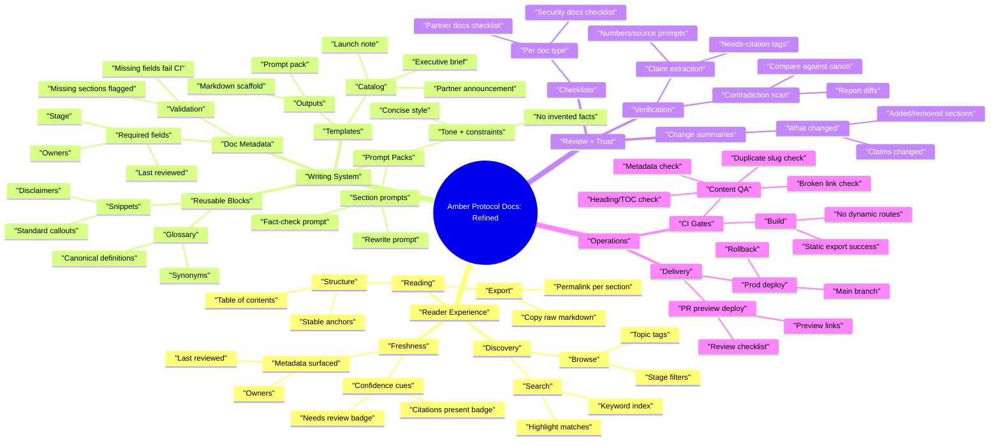
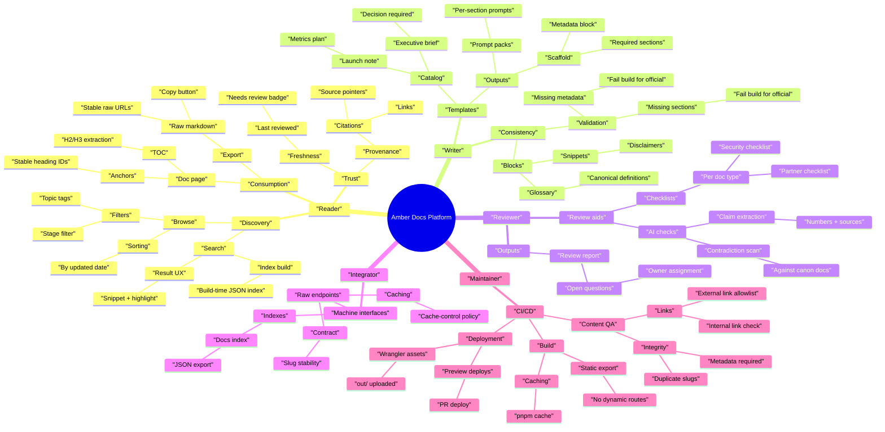

# Product Mindmap (5 Layers Deep)

This repo currently builds a **static docs site** (Next.js `output: "export"`) with:
- `/docs` (library)
- `/docs/[slug]` (doc detail)
- `/raw/[slug]` (raw markdown)
- `/templates` (template tool)

Below is a 5-layer-deep feature mindmap for where to take this next.

## Mindmap (Draft)

```mermaid
mindmap
  root(("Amber Protocol Docs"))
    "Content System"
      "Doc Types"
        "Canonical Docs"
          "Protocol overview"
          "Token mechanics"
          "Security model"
        "Operational Docs"
          "Runbooks"
          "Incident postmortems"
          "Partner playbooks"
        "Release Docs"
          "Changelogs"
          "Launch notes"
          "Migration guides"
      "Document Shape"
        "Frontmatter"
          "Stage (Draft/Final/Official)"
          "Owners"
          "Last reviewed date"
        "Sections"
          "Required sections per template"
          "Optional sections library"
        "Governance"
          "Approval checklist"
          "Promotion gates"
      "Storage Model"
        "Static Source"
          "Repo markdown"
          "Generated pages"
        "Future Hybrid"
          "CMS/DB backed"
          "Revision history"
    "Publishing"
      "Static Export"
        "Cloudflare Pages"
          "PR preview deploys"
          "Main branch prod deploy"
        "SEO"
          "Sitemap correctness"
          "Robots rules"
      "Routes"
        "Docs Library"
          "Filters"
          "Search"
        "Doc Detail"
          "Anchors"
          "Copy raw"
        "Raw Endpoints"
          "Stable URL contract"
          "Cache headers"
    "Template Tool"
      "Template Catalog"
        "Executive Brief"
          "Decision-oriented"
          "Risk register"
        "Launch Note"
          "Ops checklist"
          "Metrics plan"
        "Partner Announcement"
          "Legal checklist"
          "Fact-check list"
      "Generation Outputs"
        "AI Prompt Pack"
          "Single-shot prompt"
          "Section-by-section prompts"
        "Markdown Scaffold"
          "Metadata block"
          "Section headers"
      "Template Authoring"
        "Local JSON/TS definitions"
          "Typed schema"
          "Validation"
        "Future AI-Assisted"
          "Template-from-example"
          "Auto-required fields inference"
    "Quality + Trust"
      "Review Workflow"
        "AI checks"
          "Claim extraction"
          "Contradiction scan"
        "Human review"
          "Owners"
          "Approvers"
      "Verification"
        "Citations"
          "Links"
          "Source-of-truth pointers"
        "Change control"
          "Changelog entries"
          "Review dates"
      "Safety"
        "Public vs private partition"
          "Redaction"
          "Secrets scanning"
        "Legal"
          "Disclaimers"
          "Trademark usage"
    "Developer Experience"
      "Contribution Flow"
        "Markdown lint"
          "Broken links"
          "Heading structure"
        "PR templates"
          "Doc checklist"
          "Template checklist"
      "Tooling"
        "Local preview"
          "Fast dev server"
          "Build parity"
        "CI"
          "Build caching"
          "Deploy gates"
```

## User Stories (Draft)

### Reader (public)
- As a reader, I want keyword search so I can find answers quickly.
- As a reader, I want filters by stage and topic so I can focus on official docs.
- As a reader, I want stable anchors and a table of contents so I can deep-link sections.
- As a reader, I want a copy action for raw markdown so I can paste into my AI tool.
- As a reader, I want visible freshness metadata so I can judge whether a doc is current.
- As a reader, I want “related docs” so I can follow the intended reading path.
- As a reader, I want a clear “this is not financial advice” and similar disclaimers where appropriate so I can interpret claims correctly.

### Integrator (builder)
- As an integrator, I want a stable raw markdown URL contract so I can fetch docs programmatically.
- As an integrator, I want predictable caching headers so I can balance freshness and performance.
- As an integrator, I want a machine-readable index so I can build my own search and navigation.

### Writer (internal)
- As a writer, I want templates for common doc types so I can produce consistent shapes.
- As a writer, I want section-by-section prompt packs so I can iterate without rewriting the whole document.
- As a writer, I want required metadata fields so docs have owners, review date, and status.
- As a writer, I want validation that flags missing sections and missing metadata before publish.
- As a writer, I want reusable phrasing blocks so I can keep tone and definitions consistent.

### Reviewer (internal)
- As a reviewer, I want a checklist per doc type so I can review consistently.
- As a reviewer, I want extracted claims with “needs-source” flags so I can verify facts efficiently.
- As a reviewer, I want contradiction checks against canonical docs so updates do not drift.
- As a reviewer, I want a change summary so I can quickly understand what moved.

### Maintainer (dev/ops)
- As a maintainer, I want PR preview deploys so I can review changes safely.
- As a maintainer, I want build caching so deploys are faster and more reliable.
- As a maintainer, I want a clean static export path so Cloudflare deploys never depend on server routes.
- As a maintainer, I want automated content QA so broken links and malformed docs fail CI.

## User Stories (Refined With Acceptance Criteria)

### Search and browse
1. As a reader, I want search that matches titles, headings, and body text so I can find relevant docs.
2. Acceptance criteria: Search works offline in static export and does not require a server.
3. Acceptance criteria: Search results show doc title, short snippet, and last updated.

### Doc freshness and ownership
1. As a reader, I want to see owners and last reviewed date so I can trust freshness.
2. Acceptance criteria: A doc without last reviewed is visibly marked “needs review”.
3. Acceptance criteria: Owners are shown on the doc detail view and in the library list.

### Template-driven writing
1. As a writer, I want templates to generate both markdown scaffolds and prompt packs so I can draft faster and stay consistent.
2. Acceptance criteria: Each template declares required fields and required sections.
3. Acceptance criteria: The tool can output section prompts for rewrite, fact-check, and consistency checks.

### Content QA in CI
1. As a maintainer, I want CI to fail on broken internal links and duplicate slugs so we never ship a broken docs site.
2. Acceptance criteria: Build fails if two docs share a slug.
3. Acceptance criteria: Build fails if any doc is missing required metadata for its stage.

## Mindmap (Refined From Stories)

Key refinements:
- Promote **Search + IA** to first-class (reader value).
- Split **Template outputs** into "prompt packs" vs "scaffolds" with explicit "section prompts".
- Add **Doc metadata** (owners/last reviewed) as required platform capability.
- Add **QA automation** (broken links, missing headings, missing metadata) as CI gates.



## Mindmap (Refined, 5-Layer Version)

This version makes the “5 layers down” constraint explicit across the major branches.


