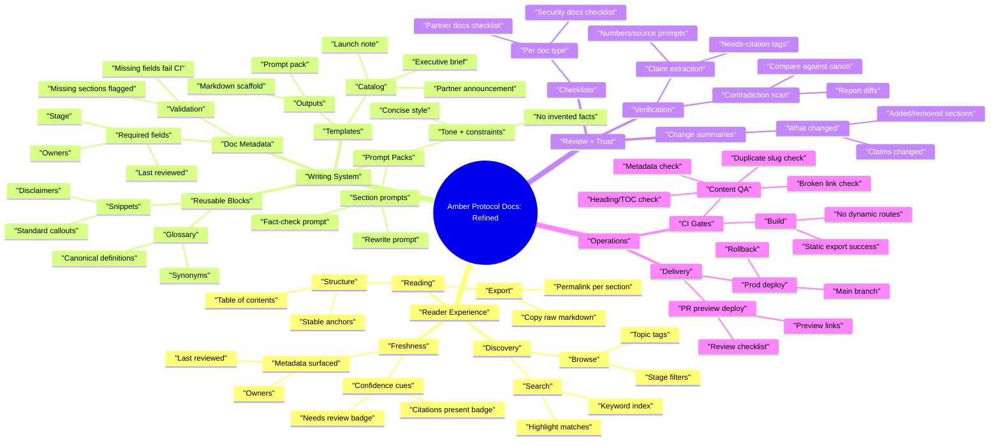
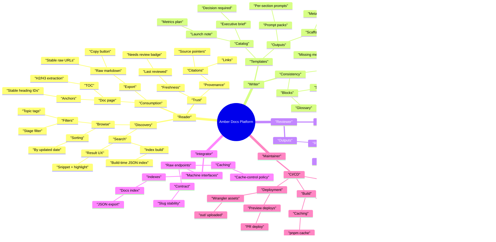

# Product Mindmap (5 Layers Deep)

This repo currently builds a **static docs site** (Next.js `output: "export"`) with:
- `/docs` (library)
- `/docs/[slug]` (doc detail)
- `/raw/[slug]` (raw markdown)
- `/templates` (template tool)

Below is a 5-layer-deep feature mindmap for where to take this next.

## Mindmap (Draft)

```mermaid
mindmap
  root(("Amber Protocol Docs"))
    "Content System"
      "Doc Types"
        "Canonical Docs"
          "Protocol overview"
          "Token mechanics"
          "Security model"
        "Operational Docs"
          "Runbooks"
          "Incident postmortems"
          "Partner playbooks"
        "Release Docs"
          "Changelogs"
          "Launch notes"
          "Migration guides"
      "Document Shape"
        "Frontmatter"
          "Stage (Draft/Final/Official)"
          "Owners"
          "Last reviewed date"
        "Sections"
          "Required sections per template"
          "Optional sections library"
        "Governance"
          "Approval checklist"
          "Promotion gates"
      "Storage Model"
        "Static Source"
          "Repo markdown"
          "Generated pages"
        "Future Hybrid"
          "CMS/DB backed"
          "Revision history"
    "Publishing"
      "Static Export"
        "Cloudflare Pages"
          "PR preview deploys"
          "Main branch prod deploy"
        "SEO"
          "Sitemap correctness"
          "Robots rules"
      "Routes"
        "Docs Library"
          "Filters"
          "Search"
        "Doc Detail"
          "Anchors"
          "Copy raw"
        "Raw Endpoints"
          "Stable URL contract"
          "Cache headers"
    "Template Tool"
      "Template Catalog"
        "Executive Brief"
          "Decision-oriented"
          "Risk register"
        "Launch Note"
          "Ops checklist"
          "Metrics plan"
        "Partner Announcement"
          "Legal checklist"
          "Fact-check list"
      "Generation Outputs"
        "AI Prompt Pack"
          "Single-shot prompt"
          "Section-by-section prompts"
        "Markdown Scaffold"
          "Metadata block"
          "Section headers"
      "Template Authoring"
        "Local JSON/TS definitions"
          "Typed schema"
          "Validation"
        "Future AI-Assisted"
          "Template-from-example"
          "Auto-required fields inference"
    "Quality + Trust"
      "Review Workflow"
        "AI checks"
          "Claim extraction"
          "Contradiction scan"
        "Human review"
          "Owners"
          "Approvers"
      "Verification"
        "Citations"
          "Links"
          "Source-of-truth pointers"
        "Change control"
          "Changelog entries"
          "Review dates"
      "Safety"
        "Public vs private partition"
          "Redaction"
          "Secrets scanning"
        "Legal"
          "Disclaimers"
          "Trademark usage"
    "Developer Experience"
      "Contribution Flow"
        "Markdown lint"
          "Broken links"
          "Heading structure"
        "PR templates"
          "Doc checklist"
          "Template checklist"
      "Tooling"
        "Local preview"
          "Fast dev server"
          "Build parity"
        "CI"
          "Build caching"
          "Deploy gates"
```

## User Stories (Draft)

### Reader (public)
- As a reader, I want keyword search so I can find answers quickly.
- As a reader, I want filters by stage and topic so I can focus on official docs.
- As a reader, I want stable anchors and a table of contents so I can deep-link sections.
- As a reader, I want a copy action for raw markdown so I can paste into my AI tool.
- As a reader, I want visible freshness metadata so I can judge whether a doc is current.
- As a reader, I want “related docs” so I can follow the intended reading path.
- As a reader, I want a clear “this is not financial advice” and similar disclaimers where appropriate so I can interpret claims correctly.

### Integrator (builder)
- As an integrator, I want a stable raw markdown URL contract so I can fetch docs programmatically.
- As an integrator, I want predictable caching headers so I can balance freshness and performance.
- As an integrator, I want a machine-readable index so I can build my own search and navigation.

### Writer (internal)
- As a writer, I want templates for common doc types so I can produce consistent shapes.
- As a writer, I want section-by-section prompt packs so I can iterate without rewriting the whole document.
- As a writer, I want required metadata fields so docs have owners, review date, and status.
- As a writer, I want validation that flags missing sections and missing metadata before publish.
- As a writer, I want reusable phrasing blocks so I can keep tone and definitions consistent.

### Reviewer (internal)
- As a reviewer, I want a checklist per doc type so I can review consistently.
- As a reviewer, I want extracted claims with “needs-source” flags so I can verify facts efficiently.
- As a reviewer, I want contradiction checks against canonical docs so updates do not drift.
- As a reviewer, I want a change summary so I can quickly understand what moved.

### Maintainer (dev/ops)
- As a maintainer, I want PR preview deploys so I can review changes safely.
- As a maintainer, I want build caching so deploys are faster and more reliable.
- As a maintainer, I want a clean static export path so Cloudflare deploys never depend on server routes.
- As a maintainer, I want automated content QA so broken links and malformed docs fail CI.

## User Stories (Refined With Acceptance Criteria)

### Search and browse
1. As a reader, I want search that matches titles, headings, and body text so I can find relevant docs.
2. Acceptance criteria: Search works offline in static export and does not require a server.
3. Acceptance criteria: Search results show doc title, short snippet, and last updated.

### Doc freshness and ownership
1. As a reader, I want to see owners and last reviewed date so I can trust freshness.
2. Acceptance criteria: A doc without last reviewed is visibly marked “needs review”.
3. Acceptance criteria: Owners are shown on the doc detail view and in the library list.

### Template-driven writing
1. As a writer, I want templates to generate both markdown scaffolds and prompt packs so I can draft faster and stay consistent.
2. Acceptance criteria: Each template declares required fields and required sections.
3. Acceptance criteria: The tool can output section prompts for rewrite, fact-check, and consistency checks.

### Content QA in CI
1. As a maintainer, I want CI to fail on broken internal links and duplicate slugs so we never ship a broken docs site.
2. Acceptance criteria: Build fails if two docs share a slug.
3. Acceptance criteria: Build fails if any doc is missing required metadata for its stage.

## Mindmap (Refined From Stories)

Key refinements:
- Promote **Search + IA** to first-class (reader value).
- Split **Template outputs** into "prompt packs" vs "scaffolds" with explicit "section prompts".
- Add **Doc metadata** (owners/last reviewed) as required platform capability.
- Add **QA automation** (broken links, missing headings, missing metadata) as CI gates.



## Mindmap (Refined, 5-Layer Version)

This version makes the “5 layers down” constraint explicit across the major branches.



---

## Refinement v2 (As-Is + Build-Out)

This section is a fresh pass based on the **current implemented app** (in `src/`) plus the existing roadmap themes above.

### Mindmap (As-Is, Verified From Code)

```mermaid
mindmap
  root(("Amber Docs Platform (As-Is, 2026-02-08)"))
    "Reader"
      "Discovery"
        "Search + filters"
          "Query title/summary/body"
          "Stage filter"
          "Topic filter"
          "Highlight matches"
        "Sorting"
          "UpdatedAt desc"
      "Doc detail"
        "Trust signals"
          "Stage badge"
          "Needs review badge"
          "Citations badge"
        "Reading aids"
          "TOC (H2/H3)"
          "Stable anchors (H2/H3)"
        "Export"
          "View raw route"
          "Copy raw markdown"
        "Context"
          "AI checks panel"
          "Related context panel"
          "Related docs section"
    "Writer"
      "Template tool"
        "Catalog"
          "Executive brief"
          "Product launch note"
          "Partner announcement"
        "Outputs"
          "Single-shot prompt"
          "Markdown scaffold"
          "Section prompt pack"
        "UX"
          "Required fields inputs"
          "Copy buttons"
      "Blocks"
        "Disclaimers"
          "Copy snippet"
        "Glossary"
          "Lifecycle terms"
      "Docs dataset"
        "In-code source"
          "src/lib/docs.ts"
          "Markdown strings per doc"
    "Reviewer"
      "AI prompt pack"
        "Full-doc prompt"
          "Rewrite/claims/contradictions/questions"
        "Section prompts"
          "Per H2 section extraction"
      "Governance cues"
        "AI checks list"
          "Per-doc checks shown"
    "Integrator"
      "Docs index"
        "GET /docs.json"
          "slug/title/stage/summary"
          "url/rawUrl fields"
        "Caching"
          "cache-control max-age=300"
      "Raw markdown"
        "GET /raw/[slug]"
          "text/markdown response"
          "404 on unknown slug"
        "Caching"
          "cache-control max-age=60"
    "Maintainer"
      "Content QA script"
        "Slug integrity"
          "Fail on duplicates"
        "Metadata policy"
          "Official requires owners/topics/reviewedAt"
        "Link integrity"
          "Fail on broken internal /docs|/raw links"
        "Structure policy"
          "At least one H2 outside fences"
      "Static export"
        "Next.js export build"
          "generateStaticParams"
      "Deploy"
        "Cloudflare Pages"
          "wrangler deploy out/"
    "Backend (Convex)"
      "Workflow model"
        "Docs table"
          "Pointers: draft/final/official"
        "Revisions table"
          "Revision numbers"
        "Notes table"
          "Notes by doc/section"
      "Admin API"
        "HTTP RPC"
          "Bearer token auth"
          "Methods: create/save/promote/archive"
```

### Mindmap (Build-Out, 5 Layers Deep)

```mermaid
mindmap
  root(("Amber Docs Platform (Build-Out vNext)"))
    "Reader"
      "Discovery"
        "Search v2"
          "Build-time index"
          "Fuzzy matching"
          "Synonyms"
        "Information architecture"
          "Collections/series"
          "Reading paths"
          "Breadcrumbs"
      "Reading"
        "Navigation"
          "Prev/next links"
          "Section permalinks"
        "Versioning"
          "Version selector"
          "Latest alias"
          "Diff between versions"
      "Engagement"
        "Feedback"
          "Helpful/unhelpful"
          "Report an issue"
        "Personalization"
          "Bookmarks"
          "Saved searches"
    "Writer"
      "Authoring"
        "File-based content"
          "Frontmatter schema"
          "Markdown/MDX support"
          "Assets (images/diagrams)"
        "Editor workflow"
          "Local preview parity"
          "Lint + format"
      "Templates"
        "Template authoring"
          "Schema-driven templates"
          "Conditional sections"
        "Template sharing"
          "Team registry"
          "Export/import"
      "Blocks"
        "Library UX"
          "Tags + search"
          "Custom blocks"
    "Reviewer"
      "Workflow"
        "Promotion gates"
          "Draft→Final→Official"
          "Required approvals"
          "Stage checklists"
        "Review assignments"
          "Owner routing"
          "Due dates"
      "Tooling"
        "Diff view"
          "Revision diffs"
          "Section diffs"
        "Notes"
          "Inline comments"
          "Resolve threads"
      "Automated checks"
        "Claims"
          "Numbers/entities flagged"
          "Citation-required policy"
        "Consistency"
          "Contradiction scan vs canon"
          "Terminology enforcement"
        "Links"
          "External link validation"
          "Redirect detection"
    "Integrator"
      "Docs API"
        "Versioned docs index"
          "Documented schema"
          "ETag/Last-Modified"
        "Raw contract"
          "Stable slugs"
          "Cache policy"
      "RAG exports"
        "Chunked docs"
          "Stable chunk IDs"
          "Tokenizer-aware chunking"
        "Embeddings manifest"
          "Content hashes"
          "Update diffs"
      "Webhooks"
        "Doc updates"
          "Signed payloads"
          "Retry policy"
    "Maintainer"
      "CI/CD"
        "Preview deploys"
          "PR previews"
          "Preview URL comment"
        "Build performance"
          "Cache strategy"
          "Bundle budgets"
      "Quality gates"
        "Content"
          "Spell/style checks"
          "Frontmatter validation"
        "Security"
          "Secret scanning"
          "Dependency auditing"
        "Accessibility"
          "A11y checks"
          "Keyboard navigation"
      "Observability"
        "Analytics"
          "Search usage"
          "Top docs"
        "Error tracking"
          "Client errors"
          "Route 404s"
      "Architecture"
        "Hybrid model"
          "Convex as CMS"
          "Admin UI for editing"
          "Static export from CMS"
    "Security/Admin"
      "Access control"
        "Private docs"
          "Auth + roles"
          "Redaction rules"
        "Public partition"
          "Approved-only publish"
          "Audit log"
      "Governance"
        "Policy"
          "Review SLA"
          "Retention rules"
        "Compliance"
          "Disclaimers by doc type"
          "Trademark + license"
```

## User Stories (Build-Out Draft)

### Reader
- As a reader, I want fuzzy search (not exact-match only) so I can find docs even if my wording is different.
- As a reader, I want docs grouped into collections/paths so I can follow the intended learning order.
- As a reader, I want breadcrumbs and prev/next navigation so I always know where I am.
- As a reader, I want a version selector and a “latest” alias so I can reference the correct protocol version.
- As a reader, I want a diff view between versions so I can see what changed.
- As a reader, I want to give feedback (helpful/unhelpful + comment) so the docs improve.
- As a reader, I want to bookmark docs so I can return to the pages I use most.

### Writer
- As a writer, I want docs stored as markdown files with validated frontmatter so the content system scales beyond hardcoded arrays.
- As a writer, I want MDX + assets (images/diagrams) so I can explain complex concepts precisely.
- As a writer, I want a style/lint toolchain for docs so consistency does not depend on individual authors.
- As a writer, I want schema-driven templates (with conditional sections) so templates fit multiple doc variants.
- As a writer, I want to share and import/export templates so teams can converge on standard doc shapes.
- As a writer, I want blocks/snippets to support tags + search so I can reuse standard language quickly.

### Reviewer
- As a reviewer, I want promotion gates with required approvals so “Official” is trustworthy.
- As a reviewer, I want a revision diff view so I can review changes quickly.
- As a reviewer, I want inline comments with resolved/unresolved state so feedback is trackable.
- As a reviewer, I want automated claim extraction (numbers/entities) so I can verify facts efficiently.
- As a reviewer, I want terminology enforcement against the glossary so definitions don’t drift.
- As a reviewer, I want external link validation so published docs don’t rot silently.

### Integrator
- As an integrator, I want a versioned `docs.json` schema so I can build stable consumers.
- As an integrator, I want ETag/Last-Modified on `docs.json` and `raw/*` so syncing is efficient.
- As an integrator, I want a chunked docs export with stable chunk IDs so RAG pipelines don’t churn.
- As an integrator, I want webhooks for doc updates so I can refresh indexes automatically.

### Maintainer
- As a maintainer, I want PR preview deploys that comment the preview URL so review is fast and reliable.
- As a maintainer, I want stronger content QA (spelling/style/frontmatter/external links) so quality doesn’t regress.
- As a maintainer, I want security scans (secrets/deps) so the docs pipeline doesn’t leak or drift.
- As a maintainer, I want analytics + error tracking so we can detect breakages and measure usefulness.

### Admin / Security
- As an admin, I want private docs with role-based access so internal drafts and runbooks are protected.
- As an admin, I want an audit log for promotions and edits so governance is enforceable.
- As an admin, I want the public site to be exported from approved content only so private data never ships.

## User Stories (Refined Once More)

Refinement goals:
- Collapse overlap into a smaller set of **epics**.
- Add **priority** and **acceptance criteria**.

### Epic A: Content Source of Truth (Priority: Now)
1. As a writer, I want docs stored as markdown files with validated frontmatter so the system scales beyond hardcoded arrays.
2. Acceptance criteria: Docs load from `content/` (or similar) in build; no doc content lives in `src/lib/docs.ts`.
3. Acceptance criteria: Frontmatter schema validates `slug/title/stage/summary/updatedAt` and blocks “Official” without `owners/topics/lastReviewedAt`.

### Epic B: Navigation + Search v2 (Priority: Now)
1. As a reader, I want fuzzy search and structured navigation so I can find and understand docs quickly.
2. Acceptance criteria: Search is build-time indexed (static export friendly) and supports fuzzy matching.
3. Acceptance criteria: Docs support collections + breadcrumbs + prev/next links.

### Epic C: Review Workflow + Diffs (Priority: Next)
1. As a reviewer, I want diffs and inline comments so review is fast and auditable.
2. Acceptance criteria: Each doc revision is linkable and can be diffed against another revision.
3. Acceptance criteria: Comments can be resolved/unresolved and tied to a doc section.

### Epic D: Trust Automation (Priority: Next)
1. As a reviewer, I want automated claim extraction and citation enforcement so we catch ungrounded claims early.
2. Acceptance criteria: CI fails for “Official” docs if claim checks or citation policy fails (configurable).
3. Acceptance criteria: External links are validated in CI with timeouts and redirect handling.

### Epic E: Integrator Exports (Priority: Next)
1. As an integrator, I want versioned schemas and chunked exports so I can build stable RAG/sync systems.
2. Acceptance criteria: `docs.json` is versioned and documented; `ETag` or `Last-Modified` is present.
3. Acceptance criteria: Chunk export emits stable `chunkId` derived from `slug + heading path + content hash`.

### Epic F: Ops + Observability (Priority: Later)
1. As a maintainer, I want preview deploys, analytics, and error tracking so we can operate the docs product.
2. Acceptance criteria: PRs receive a preview URL comment; previews are auto-cleaned up.
3. Acceptance criteria: Analytics captures search queries (privacy-safe) and top docs; error tracking captures route errors.

## Mindmap (Refined v2)

```mermaid
mindmap
  root(("Amber Docs Platform (Refined v2)"))
    "[Now] Content source of truth"
      "File-based docs"
        "Frontmatter schema"
          "Stage/owners/review dates"
        "Build pipeline"
          "Generate docs.json"
    "[Now] Navigation + search v2"
      "Information architecture"
        "Collections + paths"
          "Breadcrumbs + prev/next"
        "Search index"
          "Fuzzy + synonyms"
    "[Next] Review workflow"
      "Revisions"
        "Diff view"
          "Section diffs"
        "Inline comments"
          "Resolve threads"
      "Promotion gates"
        "Draft→Final→Official"
          "Required approvals"
    "[Next] Trust automation"
      "Claims"
        "Extraction"
          "Numbers/entities flagged"
        "Citations"
          "Citation-required policy"
      "Links"
        "External validation"
          "Redirect detection"
    "[Next] Integrator exports"
      "Versioned docs index"
        "Schema + caching"
          "ETag/Last-Modified"
      "RAG exports"
        "Chunked docs"
          "Stable chunk IDs"
    "[Later] Ops + observability"
      "CI/CD"
        "PR preview deploys"
          "Preview URL comment"
      "Telemetry"
        "Analytics"
          "Search + top docs"
        "Error tracking"
          "Client + 404s"
    "[Later] Private + governance"
      "Access control"
        "Roles"
          "Private docs"
      "Audit"
        "Promotion log"
          "Who/what/when"
```
