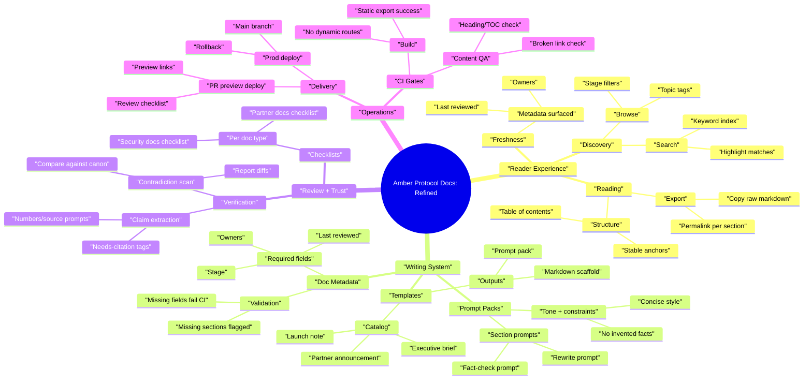

# Product Mindmap (5 Layers Deep)

This repo currently builds a **static docs site** (Next.js `output: "export"`) with:
- `/docs` (library)
- `/docs/[slug]` (doc detail)
- `/raw/[slug]` (raw markdown)
- `/templates` (template tool)

Below is a 5-layer-deep feature mindmap for where to take this next.

## Mindmap (Draft)

```mermaid
mindmap
  root(("Amber Protocol Docs"))
    "Content System"
      "Doc Types"
        "Canonical Docs"
          "Protocol overview"
          "Token mechanics"
          "Security model"
        "Operational Docs"
          "Runbooks"
          "Incident postmortems"
          "Partner playbooks"
        "Release Docs"
          "Changelogs"
          "Launch notes"
          "Migration guides"
      "Document Shape"
        "Frontmatter"
          "Stage (Draft/Final/Official)"
          "Owners"
          "Last reviewed date"
        "Sections"
          "Required sections per template"
          "Optional sections library"
        "Governance"
          "Approval checklist"
          "Promotion gates"
      "Storage Model"
        "Static Source"
          "Repo markdown"
          "Generated pages"
        "Future Hybrid"
          "CMS/DB backed"
          "Revision history"
    "Publishing"
      "Static Export"
        "Cloudflare Pages"
          "PR preview deploys"
          "Main branch prod deploy"
        "SEO"
          "Sitemap correctness"
          "Robots rules"
      "Routes"
        "Docs Library"
          "Filters"
          "Search"
        "Doc Detail"
          "Anchors"
          "Copy raw"
        "Raw Endpoints"
          "Stable URL contract"
          "Cache headers"
    "Template Tool"
      "Template Catalog"
        "Executive Brief"
          "Decision-oriented"
          "Risk register"
        "Launch Note"
          "Ops checklist"
          "Metrics plan"
        "Partner Announcement"
          "Legal checklist"
          "Fact-check list"
      "Generation Outputs"
        "AI Prompt Pack"
          "Single-shot prompt"
          "Section-by-section prompts"
        "Markdown Scaffold"
          "Metadata block"
          "Section headers"
      "Template Authoring"
        "Local JSON/TS definitions"
          "Typed schema"
          "Validation"
        "Future AI-Assisted"
          "Template-from-example"
          "Auto-required fields inference"
    "Quality + Trust"
      "Review Workflow"
        "AI checks"
          "Claim extraction"
          "Contradiction scan"
        "Human review"
          "Owners"
          "Approvers"
      "Verification"
        "Citations"
          "Links"
          "Source-of-truth pointers"
        "Change control"
          "Changelog entries"
          "Review dates"
      "Safety"
        "Public vs private partition"
          "Redaction"
          "Secrets scanning"
        "Legal"
          "Disclaimers"
          "Trademark usage"
    "Developer Experience"
      "Contribution Flow"
        "Markdown lint"
          "Broken links"
          "Heading structure"
        "PR templates"
          "Doc checklist"
          "Template checklist"
      "Tooling"
        "Local preview"
          "Fast dev server"
          "Build parity"
        "CI"
          "Build caching"
          "Deploy gates"
```

## User Stories (Draft)

### Reader (public)
- As a reader, I want to search docs by keyword so I can find answers quickly.
- As a reader, I want filters by stage/topic so I can focus on official docs.
- As a reader, I want stable anchors and a table of contents so I can deep-link sections.
- As a reader, I want a "copy raw markdown" action so I can paste into my AI tool.
- As a reader, I want an "updated/last reviewed" date so I can judge freshness.

### Writer (internal)
- As a writer, I want templates for common doc types so I can produce consistent shapes.
- As a writer, I want section-by-section prompt packs so I can iterate without rewriting the whole doc.
- As a writer, I want required metadata fields so docs have owners, review date, and status.
- As a writer, I want a preview + validation step so I can catch missing sections before publishing.

### Reviewer (internal)
- As a reviewer, I want a checklist per doc type so I can review consistently.
- As a reviewer, I want extracted claims and “needs-source” flags so I can verify facts efficiently.
- As a reviewer, I want contradiction checks against “canonical docs” so updates don’t drift.

### Maintainer (dev/ops)
- As a maintainer, I want PR preview deploys so I can review changes safely.
- As a maintainer, I want build caching so deploys are faster and more reliable.
- As a maintainer, I want a clean static export path so Cloudflare Pages deploys always work.

## Mindmap (Refined From Stories)

Key refinements:
- Promote **Search + IA** to first-class (reader value).
- Split **Template outputs** into "prompt packs" vs "scaffolds" with explicit "section prompts".
- Add **Doc metadata** (owners/last reviewed) as required platform capability.
- Add **QA automation** (broken links, missing headings, missing metadata) as CI gates.



